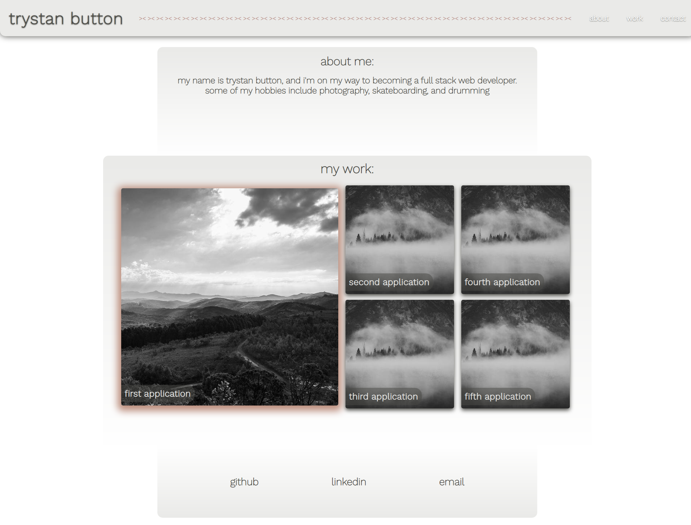

# Portfolio

The purpose of this site is to show my programming portfolio to future employers

## Process

I first started creating the website with a more hover oriented design, but then scrapped it because I didn't like how it looked

The next idea I had was to create a site with a minimalistic and cleaner design, with a really good color palette, and a lot of subtle shadows

The images/applications in the work section are just placeholders for now

### Screenshot and link to deployed application

#### https://trystan333.github.io/portfolio/

